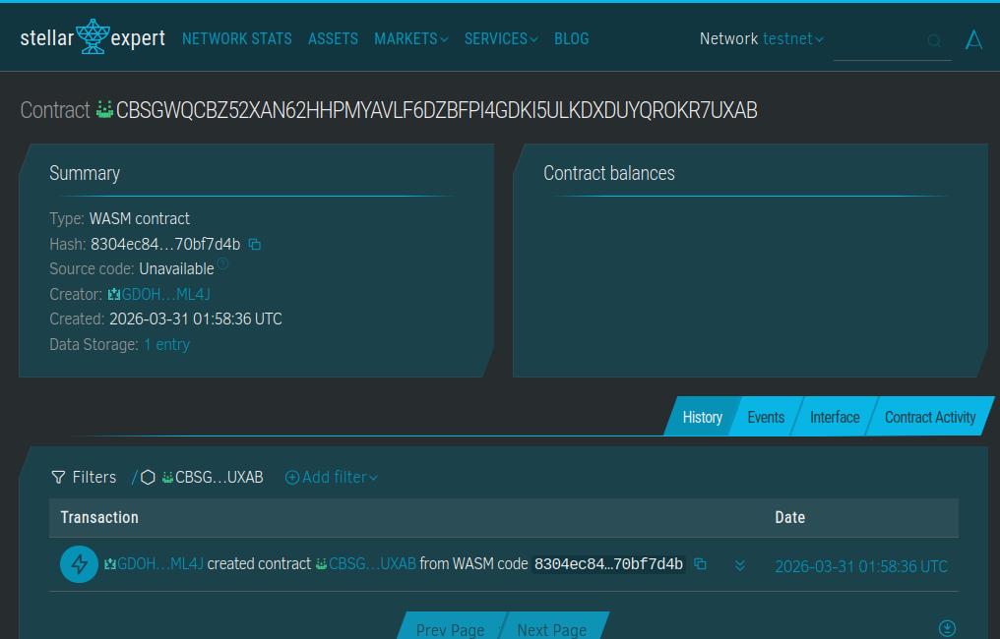

# TulongTap: Offline First Disaster Relief

## Problem
During severe typhoons in the Philippines, power grids and cellular networks fail. Standard crypto wallets are useless for buying emergency supplies because they require a live internet connection to sign and broadcast transactions. 

## Solution
TulongTap uses Stellar Soroban's native authorization framework to allow offline signing. Victims tap an NFC card or phone at a local Sari-Sari store to generate a cryptographic signature. The merchant collects these signatures offline and syncs them to the Soroban contract once internet access is restored, releasing the USDC.

## 🚀 Deployed Smart Contract

* **Contract ID:** CBSGWQCBZ52XAN62HHPMYAVLF6DZBFPI4GDKI5ULKDXDUYQROKR7UXAB
* **Network:** Stellar Testnet
* **Explorer:** https://stellar.expert/explorer/testnet/contract/CBSGWQCBZ52XAN62HHPMYAVLF6DZBFPI4GDKI5ULKDXDUYQROKR7UXAB

### 📸 Explorer Screenshot

## Stellar Advantage
- **Offline Authorization:** Uses Soroban's `require_auth` to process deferred transactions.
- **Gas-less for Victims:** NGOs fund the contract, and merchants pay the sync fee. Victims need zero XLM to buy food.
- **Micro-payments:** Near-zero fees make small Sari-Sari store purchases viable.

